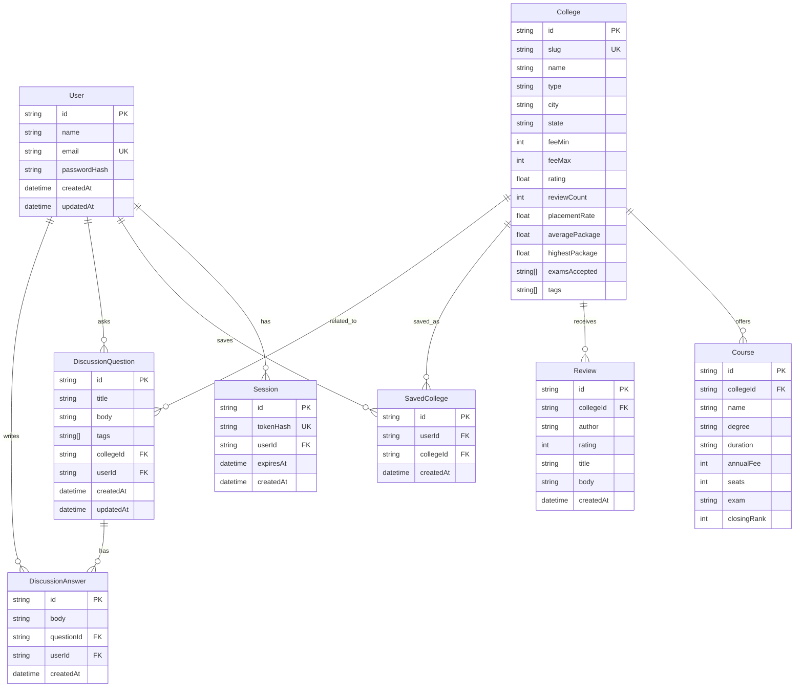
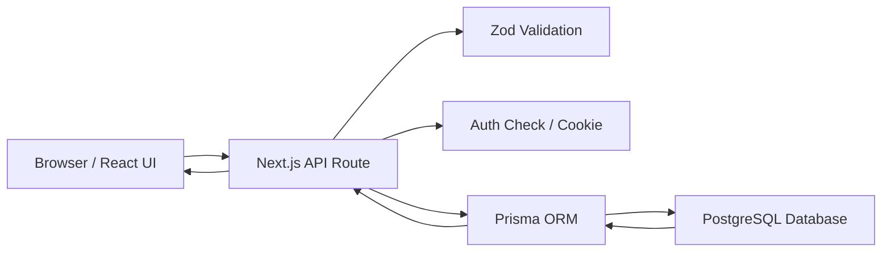
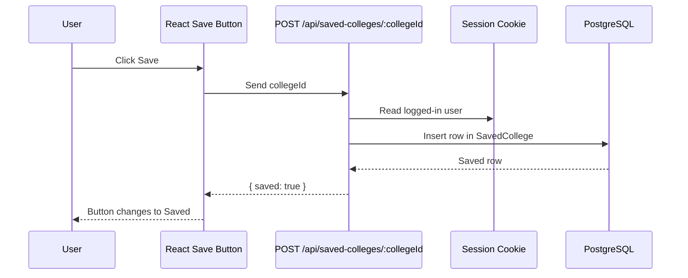

# Database Schema Diagram

```mermaid
erDiagram
  User ||--o{ Session : has
  User ||--o{ SavedCollege : saves
  User ||--o{ DiscussionQuestion : asks
  User ||--o{ DiscussionAnswer : writes

  College ||--o{ Course : offers
  College ||--o{ Review : receives
  College ||--o{ SavedCollege : saved_as
  College ||--o{ DiscussionQuestion : related_to

  DiscussionQuestion ||--o{ DiscussionAnswer : has

  User {
    string id PK
    string name
    string email UK
    string passwordHash
    datetime createdAt
    datetime updatedAt
  }

  Session {
    string id PK
    string tokenHash UK
    string userId FK
    datetime expiresAt
    datetime createdAt
  }

  College {
    string id PK
    string slug UK
    string name
    string type
    string city
    string state
    int feeMin
    int feeMax
    float rating
    int reviewCount
    float placementRate
    float averagePackage
    float highestPackage
    string[] examsAccepted
    string[] tags
  }

  Course {
    string id PK
    string collegeId FK
    string name
    string degree
    string duration
    int annualFee
    int seats
    string exam
    int closingRank
  }

  Review {
    string id PK
    string collegeId FK
    string author
    int rating
    string title
    string body
    datetime createdAt
  }

  SavedCollege {
    string id PK
    string userId FK
    string collegeId FK
    datetime createdAt
  }

  DiscussionQuestion {
    string id PK
    string title
    string body
    string[] tags
    string collegeId FK
    string userId FK
    datetime createdAt
    datetime updatedAt
  }

  DiscussionAnswer {
    string id PK
    string body
    string questionId FK
    string userId FK
    datetime createdAt
  }
```

## Data Flow

```mermaid
flowchart LR
  Browser["Browser / React UI"]
  API["Next.js API Route"]
  Validation["Zod Validation"]
  Auth["Auth Check / Cookie"]
  Prisma["Prisma ORM"]
  DB["PostgreSQL Database"]

  Browser --> API
  API --> Validation
  API --> Auth
  API --> Prisma
  Prisma --> DB
  DB --> Prisma
  Prisma --> API
  API --> Browser
```

## Example: Saving A College

```mermaid
sequenceDiagram
  participant U as User
  participant UI as React Save Button
  participant API as POST /api/saved-colleges/:collegeId
  participant Auth as Session Cookie
  participant DB as PostgreSQL

  U->>UI: Click Save
  UI->>API: Send collegeId
  API->>Auth: Read logged-in user
  API->>DB: Insert row in SavedCollege
  DB-->>API: Saved row
  API-->>UI: { saved: true }
  UI-->>U: Button changes to Saved
```
